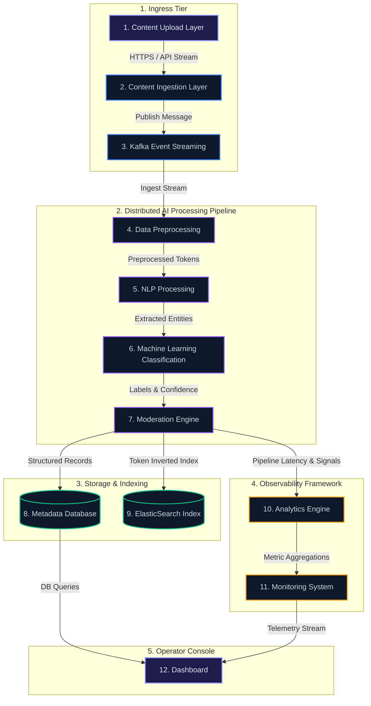

# System Architecture Diagram

Below is the visual system architecture topology map for TagSense AI. 

> [!TIP]
> To render this diagram visually in your editor, open the markdown preview (e.g. `Cmd+Shift+V` in VS Code or click the preview button).

